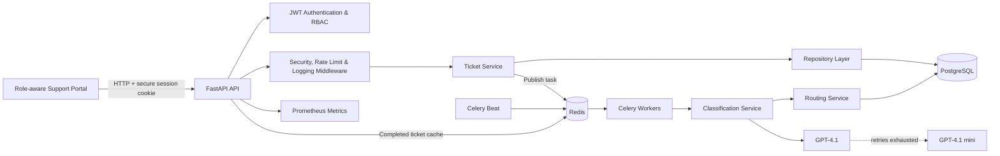
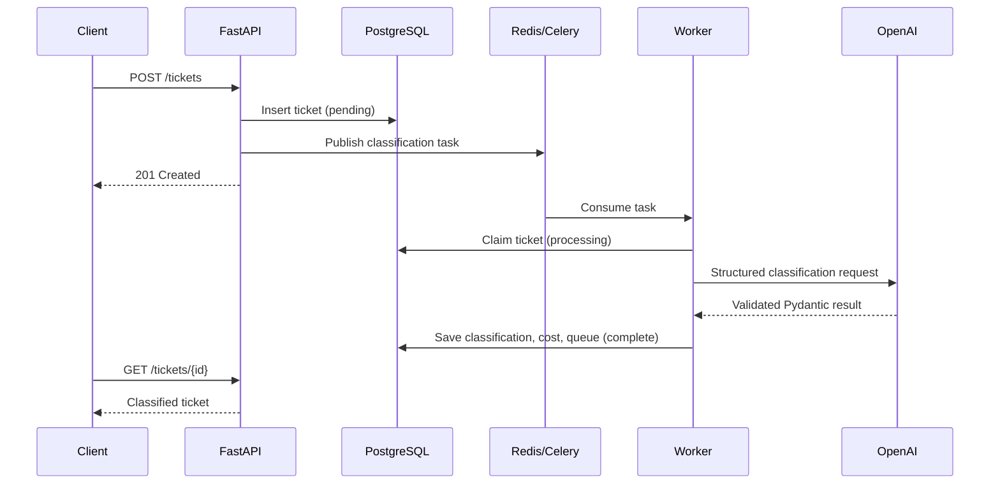
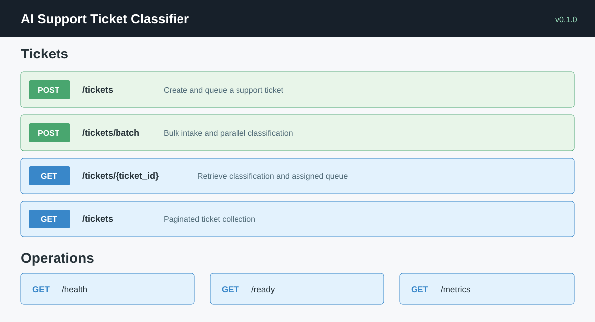
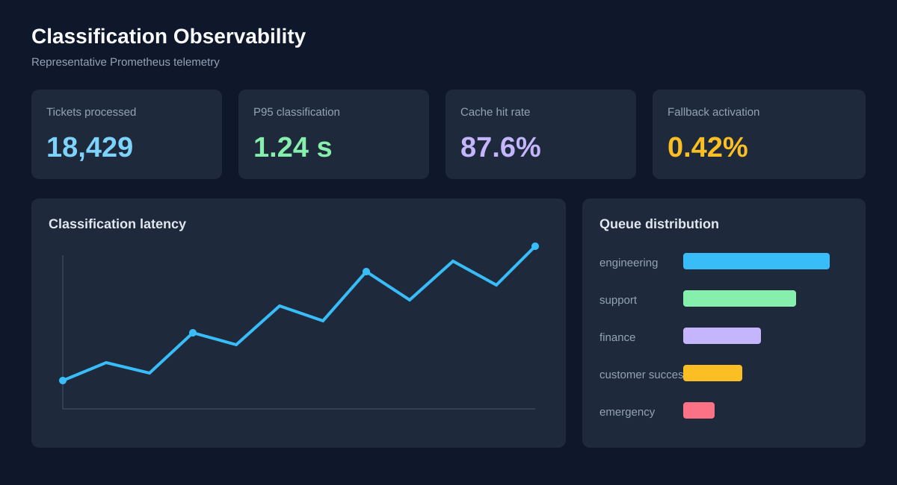

# AI Support Ticket Classifier

Production-ready support-ticket classification API built with FastAPI, PostgreSQL, Redis, Celery, and OpenAI Structured Outputs.

The service accepts support tickets, persists them immediately, classifies urgency and category asynchronously, assigns an operational queue, and exposes the result through a typed REST API. It demonstrates backend architecture, resilient AI integration, distributed task processing, observability, and deployment engineering.

> **Engineering highlights:** 94 automated tests, 91.68% coverage, secure cookie-based JWT authentication, role-based data isolation, strict LLM output validation, model fallback, dead-letter handling, and Redis caching.

## Features

- Asynchronous ticket ingestion and classification
- Urgency classification: `low`, `medium`, `high`, `critical`
- Category classification: `billing`, `technical`, `bug`, `account`, `general`
- Deterministic queue routing with confidence scores
- OpenAI Responses API with Pydantic Structured Outputs
- Primary GPT-4.1 model with GPT-4.1 mini fallback
- Bounded retries with exponential backoff and jitter
- Token usage, cached-token, latency, and estimated-cost tracking
- PostgreSQL persistence through async SQLAlchemy 2.0
- Redis caching and distributed API rate limiting
- Celery workers, task groups, and durable dead-letter records
- Bulk ticket intake with one `INSERT ... RETURNING` operation
- JSON logs with request and ticket correlation IDs
- Prometheus metrics, liveness, and dependency readiness endpoints
- CORS, security headers, sanitized exceptions, and graceful shutdown
- Docker Compose deployment with migration, API, worker, and Beat services
- Responsive signup, login, customer, support-agent, and admin interfaces
- PBKDF2 password hashing and HTTP-only JWT session cookies
- Customer ownership isolation, agent assignment controls, and admin user management

## Architecture Diagram



### Ticket lifecycle



## Tech Stack

| Area | Technology |
|---|---|
| Runtime | Python 3.13 |
| API | FastAPI, Pydantic v2, Uvicorn |
| Database | PostgreSQL, async SQLAlchemy 2.0, asyncpg |
| Migrations | Alembic |
| Messaging and cache | Redis |
| Background processing | Celery Worker and Celery Beat |
| AI | OpenAI Python SDK, Responses API, Structured Outputs |
| Observability | Prometheus metrics, structured JSON logging |
| Testing | pytest, pytest-asyncio, pytest-cov, HTTPX |
| Frontend | Responsive HTML, CSS, JavaScript, Nginx |
| Deployment | Docker, Docker Compose |

## Intelligent Routing

| Classification | Assigned queue |
|---|---|
| Critical urgency | `emergency` |
| Technical or bug | `engineering` |
| Billing | `finance` |
| Account | `customer-success` |
| General | `support` |

Critical urgency takes precedence over category routing.

## API Examples

### Create an account and session

```bash
curl -c cookies.txt -X POST http://localhost:3000/api/auth/signup \
  -H "Content-Type: application/json" \
  -d '{"full_name":"Alex Morgan","email":"alex@example.com","password":"StrongPassword1","confirm_password":"StrongPassword1"}'

curl -c cookies.txt -X POST http://localhost:3000/api/auth/login \
  -H "Content-Type: application/json" \
  -d '{"email":"alex@example.com","password":"StrongPassword1"}'
```

### Create a ticket

```bash
curl -b cookies.txt -X POST http://localhost:3000/api/tickets \
  -H "Content-Type: application/json" \
  -H "X-Request-ID: demo-request-001" \
  -d '{
    "title": "Production checkout is unavailable",
    "description": "Every customer receives a 500 error when submitting payment."
  }'
```

```json
{
  "id": "64cb7a2f-2ca8-4f6c-ab9a-32acf86acfe3",
  "title": "Production checkout is unavailable",
  "description": "Every customer receives a 500 error when submitting payment.",
  "status": "pending",
  "urgency": null,
  "category": null,
  "assigned_queue": null,
  "confidence": null,
  "llm_model": null,
  "tokens_used": 0,
  "processing_time": null,
  "estimated_cost_usd": null,
  "retry_count": 0,
  "created_at": "2026-07-23T10:00:00Z",
  "updated_at": "2026-07-23T10:00:00Z"
}
```

### Retrieve the classified ticket

```bash
curl http://localhost:8000/tickets/64cb7a2f-2ca8-4f6c-ab9a-32acf86acfe3
```

```json
{
  "id": "64cb7a2f-2ca8-4f6c-ab9a-32acf86acfe3",
  "title": "Production checkout is unavailable",
  "description": "Every customer receives a 500 error when submitting payment.",
  "status": "complete",
  "urgency": "critical",
  "category": "technical",
  "assigned_queue": "emergency",
  "confidence": 0.98,
  "llm_model": "gpt-4.1",
  "tokens_used": 126,
  "processing_time": 842,
  "estimated_cost_usd": 0.00047,
  "retry_count": 0,
  "created_at": "2026-07-23T10:00:00Z",
  "updated_at": "2026-07-23T10:00:01Z"
}
```

### Batch intake

```bash
curl -X POST http://localhost:8000/tickets/batch \
  -H "Content-Type: application/json" \
  -d '{
    "tickets": [
      {"title": "Duplicate charge", "description": "I was charged twice."},
      {"title": "Cannot sign in", "description": "My account is locked."}
    ]
  }'
```

### Pagination and operations

```bash
curl "http://localhost/api/tickets?limit=20&offset=0"
curl http://localhost/api/health
curl http://localhost/api/live
curl http://localhost/api/ready
curl http://localhost/api/metrics
```

Interactive OpenAPI documentation is available at `http://localhost/api/docs`.

The support operations dashboard is available at `http://localhost` when using Docker Compose.

## Folder Structure

```text
ticketClassifier/
├── app/
│   ├── ai/                 # OpenAI adapter, prompts, schemas, and pricing
│   ├── api/                # Routers, dependencies, middleware, rate limiting
│   │   └── v1/endpoints/   # Ticket, health, readiness, and metrics endpoints
│   ├── core/               # Settings, logging, exceptions, telemetry, security
│   ├── db/                 # Async engine, session factory, declarative base
│   ├── models/             # SQLAlchemy persistence models
│   ├── repositories/       # Database query and persistence boundary
│   ├── schemas/            # Pydantic request and response contracts
│   ├── services/           # Business workflows, routing, caching, OpenAI resilience
│   ├── tasks/              # Celery classification and dead-letter tasks
│   ├── workers/            # Celery application and worker lifecycle hooks
│   └── main.py             # FastAPI application factory and lifespan
├── alembic/                # Versioned PostgreSQL migrations
├── frontend/               # Responsive dashboard and Nginx reverse proxy
├── scripts/                # Performance benchmark utilities
├── tests/                  # Unit and integration test suites
├── Dockerfile              # Non-root Python 3.13 application image
├── docker-compose.yml      # Full local deployment topology
├── pyproject.toml          # Dependencies and test/coverage configuration
└── .env.example            # Environment variable template
```

## How to Run

### Docker Compose — recommended

Requirements: Docker Engine, Docker Compose v2, and an OpenAI API key.

```powershell
Copy-Item .env.example .env
```

Set strong, independent application/JWT/database secrets, add `OPENAI_API_KEY`, and configure the
exact public HTTPS CORS origin before running:

```powershell
docker compose config -q
docker compose up --build -d
docker compose ps
```

The one-shot `migrate` service applies Alembic migrations before the API, worker, and Beat services start.

Open the dashboard at `http://localhost`. In production, use the public HTTPS domain. The API and
infrastructure ports remain private; Nginx exposes the same-origin `/api` reverse proxy.

```powershell
Invoke-RestMethod http://localhost/api/ready
docker compose logs -f api celery-worker celery-beat
```

Scale classification workers independently:

```powershell
docker compose up -d --scale celery-worker=3
```

Stop services without deleting data:

```powershell
docker compose down
```

### Local development

Start PostgreSQL and Redis, then:

```powershell
py -3.13 -m venv .venv
.\.venv\Scripts\Activate.ps1
python -m pip install -e ".[test]"
Copy-Item .env.example .env
alembic upgrade head
uvicorn app.main:app --reload
```

In separate terminals:

```powershell
celery -A app.workers.celery_app:celery_app worker --loglevel=INFO --pool=solo
celery -A app.workers.celery_app:celery_app beat --loglevel=INFO
```

Use Celery's default prefork pool on Linux. `--pool=solo` is shown for Windows development compatibility.

### Tests and coverage

```powershell
pytest
```

The repository enforces a 90% minimum coverage threshold.

## Environment Variables

Copy `.env.example` to `.env`. Never commit real credentials.

| Variable | Purpose | Default/example |
|---|---|---|
| `ENVIRONMENT` | Runtime environment | `production` |
| `HTTP_PORT` | Public proxy HTTP port | `80` |
| `DEBUG` | FastAPI debug responses | `false` |
| `LOG_LEVEL` | JSON log threshold | `INFO` |
| `POSTGRES_DB` | Compose database name | `ticket_classifier` |
| `POSTGRES_USER` | Compose database user | `ticket_classifier` |
| `POSTGRES_PASSWORD` | PostgreSQL secret | Required |
| `DATABASE_URL` | Async SQLAlchemy connection URL | `postgresql+asyncpg://...` |
| `DATABASE_POOL_SIZE` | Persistent connections per process | `10` |
| `DATABASE_MAX_OVERFLOW` | Temporary overflow connections | `20` |
| `REDIS_URL` | API cache and rate-limit Redis DB | `redis://redis:6379/0` |
| `CELERY_BROKER_URL` | Celery message broker | `redis://redis:6379/1` |
| `CELERY_RESULT_BACKEND` | Celery result storage | `redis://redis:6379/2` |
| `CELERY_WORKER_CONCURRENCY` | Processes per worker container | `4` |
| `OPENAI_API_KEY` | OpenAI credential | Required |
| `OPENAI_PRIMARY_MODEL` | Primary classifier | `gpt-4.1` |
| `OPENAI_FALLBACK_MODEL` | Fallback classifier | `gpt-4.1-mini` |
| `OPENAI_MAX_ATTEMPTS` | Attempts per model | `5` |
| `OPENAI_TIMEOUT_SECONDS` | Provider request timeout | `30` |
| `SECRET_KEY` | General application signing secret | Required |
| `JWT_SECRET_KEY` | JWT signing secret | Required and independent |
| `ACCESS_TOKEN_EXPIRE_MINUTES` | Access-cookie lifetime | `60` |
| `REFRESH_TOKEN_EXPIRE_DAYS` | Reserved refresh-token lifetime | `7` |
| `CORS_ALLOWED_ORIGINS` | Exact trusted HTTPS browser origins | `["https://support.example.com"]` |
| `RATE_LIMIT_REQUESTS` | Requests allowed per window | `60` |
| `RATE_LIMIT_WINDOW_SECONDS` | Rate-limit window | `60` |
| `TICKET_CACHE_TTL_SECONDS` | Completed-ticket cache TTL | `300` |

OpenAI prices are configurable through the `OPENAI_*_COST_PER_MILLION` variables because model pricing changes over time. See [.env.example](.env.example) for the complete configuration contract.

See [Production deployment](docs/DEPLOYMENT.md) for TLS, secret management, health checks,
monitoring, container optimization, GHCR publishing, and optional automated deployment.

## Screenshots

### Interactive API documentation



### Classification observability



The previews use representative data. Run the stack and open `/docs` and `/metrics` for live output from your environment.

## Performance

The included benchmark compares individual inserts with the bulk repository path for 100 tickets:

| Path | Time | SQL statements |
|---|---:|---:|
| Sequential inserts | 657.83 ms | 200 |
| Bulk insert | 21.38 ms | 1 |

This local SQLite measurement produced a **30.77× latency improvement** and **99.5% fewer SQL statements**. Absolute PostgreSQL results depend on infrastructure and workload.

Run it with:

```powershell
python -m scripts.benchmark_performance
```

## Reliability Decisions

- Structured Outputs constrain model generation to the Pydantic JSON Schema.
- A second validation pass prevents malformed mocked or provider responses entering business logic.
- Completed tickets alone are cached, avoiding invalidation races for mutable states.
- Provider retries are bounded to prevent infinite retry storms.
- Primary and fallback models have independent retry budgets.
- Failed terminal jobs create durable PostgreSQL dead-letter records before Redis notification.
- Health indicates process liveness; readiness verifies PostgreSQL and Redis dependencies.
- Database migrations run once instead of racing across API replicas.

## Future Improvements

- Introduce tenant isolation and per-tenant rate limits
- Add OpenTelemetry traces and distributed trace propagation into Celery
- Export dashboards and alert rules for Prometheus/Grafana
- Add human-review workflows for low-confidence classifications
- Build an evaluation dataset with accuracy and calibration regression gates
- Add webhook delivery for classification completion events
- Implement transactional outbox publishing for guaranteed task dispatch
- Deploy to Kubernetes with autoscaling based on HTTP and queue latency
- Add provider-agnostic model routing and A/B evaluation

## License

Add the license appropriate for your intended distribution before publishing the repository.
